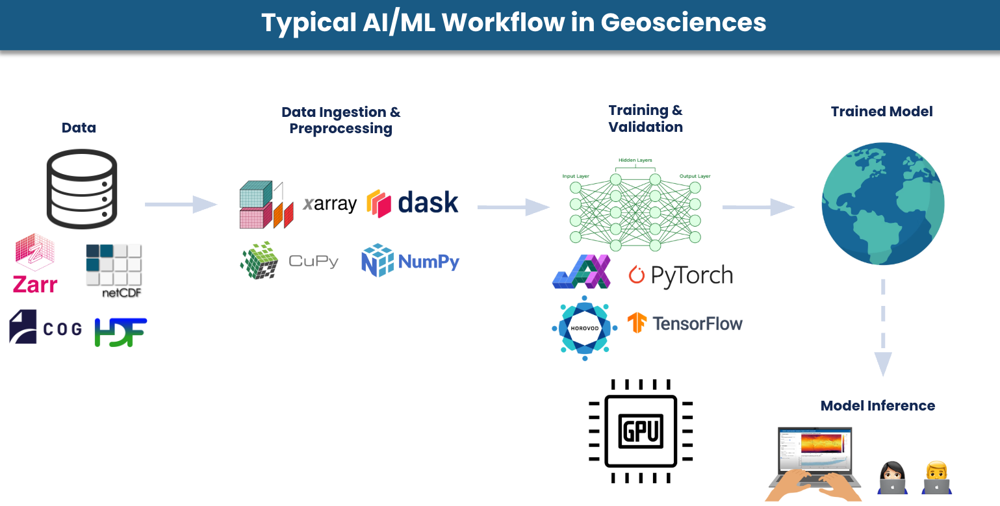
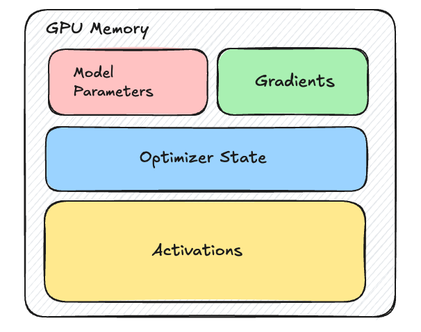

# Chapter 1: Single-GPU Baseline

Before we distribute anything, we need a solid single-GPU training script to serve as our starting point. Every distributed strategy in this guide is a modification of this baseline.

But first let's look at the typical AI/ML workflow in geosciences to understand where distributed training fits in.

<figure markdown="span">
  
  <figcaption>Figure 1: Typical AI/ML workflow in Geosciences</figcaption>
</figure>

A typical AI/ML workflow in geosciences begins with large observational or reanalysis datasets stored in formats such as Zarr, NetCDF, COG, or HDF. These datasets are often multi-dimensional, spatiotemporal, and extremely large and may include variables such as temperature, wind fields, pressure, and precipitation across many vertical levels and time steps.

These datasets are ingested and preprocessed using libraries such as xarray, Dask, CuPy, and NumPy, and—if needed—regridded. The processed data is then fed into deep learning frameworks like PyTorch or TensorFlow, where models (e.g., CNNs, U-Nets, Transformers) are trained and validated on GPUs. Once trained, the model can be deployed for inference tasks such as weather forecasting, climate downscaling, or hazard prediction. In this guide, we focus on the **training stage** and how to scale it across multiple GPUs using different distributed training strategies.

---

## A Complete Training Script

??? note "Minimal single-GPU training example"

    First, we start with a minimal but complete training loop — a U-Net predicting weather on ERA5-like data.

    !!! note
        We use a U-Net for familiarity, but production weather models typically use architectures such as:

        - **GraphCast** (graph neural networks on spherical meshes)  
        - **Pangu-Weather / Aurora** (3D Swin Transformers)  
        - **FourCastNet** (AFNO / SFNO)  
        - **GenCast** (diffusion models)  

        The distributed training patterns in this guide apply across all of these.

    ```python
    import torch
    import torch.nn as nn
    from torch.utils.data import DataLoader, Dataset

    # 1. Device
    device = torch.device("cuda:0")

    # 2. Synthetic ERA5-like Dataset
    class ERA5Dataset(Dataset):
        """
        Simulates ERA5-like data for weather prediction.
        """
        def __init__(self, num_samples=1000, num_variables=5, num_levels=13, lat=721, lon=1440):
            self.num_samples = num_samples
            self.channels = num_variables * num_levels
            self.lat = lat
            self.lon = lon

        def __len__(self):
            return self.num_samples

        def __getitem__(self, idx):
            x = torch.randn(self.channels, self.lat, self.lon)
            y = torch.randn(self.channels, self.lat, self.lon)
            return x, y

    # 3. Simple U-Net
    class SimpleUNet(nn.Module):
        def __init__(self, in_channels=65, out_channels=65, base_dim=64):
            super().__init__()

            self.enc1 = self._block(in_channels, base_dim)
            self.enc2 = self._block(base_dim, base_dim * 2)
            self.enc3 = self._block(base_dim * 2, base_dim * 4)

            self.bottleneck = self._block(base_dim * 4, base_dim * 8)

            self.up3 = nn.ConvTranspose2d(base_dim * 8, base_dim * 4, 2, 2)
            self.dec3 = self._block(base_dim * 8, base_dim * 4)

            self.up2 = nn.ConvTranspose2d(base_dim * 4, base_dim * 2, 2, 2)
            self.dec2 = self._block(base_dim * 4, base_dim * 2)

            self.up1 = nn.ConvTranspose2d(base_dim * 2, base_dim, 2, 2)
            self.dec1 = self._block(base_dim * 2, base_dim)

            self.out = nn.Conv2d(base_dim, out_channels, kernel_size=1)
            self.pool = nn.MaxPool2d(2)

        def _block(self, in_ch, out_ch):
            return nn.Sequential(
                nn.Conv2d(in_ch, out_ch, 3, padding=1),
                nn.BatchNorm2d(out_ch),
                nn.ReLU(inplace=True),
                nn.Conv2d(out_ch, out_ch, 3, padding=1),
                nn.BatchNorm2d(out_ch),
                nn.ReLU(inplace=True),
            )

        def forward(self, x):
            e1 = self.enc1(x)
            e2 = self.enc2(self.pool(e1))
            e3 = self.enc3(self.pool(e2))

            b = self.bottleneck(self.pool(e3))

            d3 = self.dec3(torch.cat([self.up3(b), e3], dim=1))
            d2 = self.dec2(torch.cat([self.up2(d3), e2], dim=1))
            d1 = self.dec1(torch.cat([self.up1(d2), e1], dim=1))

            return self.out(d1)

    # 4. Dataset + DataLoader
    train_dataset = ERA5Dataset(
        num_samples=1000,
        num_variables=5,
        num_levels=13,
        lat=181,
        lon=360,
    )

    train_loader = DataLoader(
        train_dataset,
        batch_size=4,
        shuffle=True,
        num_workers=4,
        pin_memory=True,
    )

    # 5. Model
    model = SimpleUNet().to(device)

    # 6. Optimizer
    optimizer = torch.optim.AdamW(model.parameters(), lr=1e-4, weight_decay=1e-5)

    # 7. Loss
    def latitude_weighted_mse(pred, target):
        lat = torch.linspace(90, -90, pred.shape[-2], device=pred.device)
        weights = torch.cos(torch.deg2rad(lat)).view(1, 1, -1, 1)
        weights = weights / weights.mean()
        return (weights * (pred - target) ** 2).mean()

    # 8. Training loop
    model.train()
    for epoch in range(10):
        epoch_loss = 0.0

        for data, target in train_loader:
            data = data.to(device)
            target = target.to(device)

            optimizer.zero_grad()
            output = model(data)
            loss = latitude_weighted_mse(output, target)
            loss.backward()
            optimizer.step()

            epoch_loss += loss.item()

        print(f"Epoch {epoch+1} | Loss: {epoch_loss / len(train_loader):.6f}")
    ```

---

## What Goes on GPU Memory (VRAM) in Training?
When training a deep learning model, the GPU memory (VRAM) acts as a high-speed workspace where several distinct components must coexist. If the total memory required by these components exceeds your VRAM capacity, you will encounter the **CUDA Out of Memory (OOM)** error.

During training, several key components compete for GPU memory:

- **Model parameters** (weights)   
- **Gradients** (computed during backpropagation)  
- **Optimizer states** (e.g., momentum and variance in Adam)  
- **Activations** (intermediate outputs stored for backpropagation)  

<figure markdown="span">
  
  <figcaption>Figure 2: What lives in GPU memory during training</figcaption>
</figure>

The relative size of these components can vary significantly depending on the model architecture, numerical precision, and input data characteristics. But in many geoscientific AI models, **activations are the dominant memory consumer** due to the large spatial dimensions and deep architectures used to capture complex dynamics.

----------

### Why Weather/Climate AI Models Are Memory-Hungry?

Weather and climate AI models are significantly more memory-intensive than most deep learning models used in computer vision or natural language processing. This is because the atmosphere and Earth system are high-dimensional physical systems that must be represented across space, vertical structure, multiple physical variables, and time. Together, these factors produce extremely large tensors and intermediate activations during training and inference.

- To capture fine-scale weather features, models often use high-resolution grids. For example, ERA5 reanalysis data at 0.25° resolution has a grid of 721 latitudes × 1440 longitudes, resulting in over 1 million spatial points per variable per level. 

- Forecasting models typically ingest multiple past timesteps to learn atmospheric dynamics, introducing an additional **time dimension**.

- The atmosphere must be modeled in the vertical dimension as well. For example, ERA5 resolves the atmosphere with up to 137 vertical levels from the surface to ~80 km, making atmospheric data inherently three-dimensional.

- Instead of just 3 channels like RGB images, weather models often include dozens of physical variables such as temperature, pressure, humidity, wind components, and geopotential height. Some atmospheric datasets include **tens of variables across multiple pressure levels**, further increasing tensor size.

----------

Together, these factors produce extremely large input tensors, often with dimensions like:
```
[batch, time, variables, levels, lat, lon]
```

For example, a single input sample of ERA-5 at 0.25° resolution with 5 variables at 13 pressure levels and 8 surface variables would have, sample size of:

| Dimension        | Size    | Notes                                |
|------------------|---------|--------------------------------------|
| Latitude         | 721     |       |
| Longitude        | 1440    |     |
| Pressure levels  | 13     |  Only asubset of pressure levels |
| Variables/level  | 5       | T, u, v, z, q                        |
| Surface variables| 8       | t2m, u10, v10, msl, tcwv, …         |
| **Total channels** | **73** | (13 levels × 5 vars) + 8 surface    |

```
Single input state:  73 × 721 × 1440 = ~75.8 million values
In float32:          75.8M × 4 bytes  ≈ 303 MB per sample
```
This 303 MB is just the input. During training, neural networks must also store intermediate activations for every layer so that gradients can be computed during backpropagation. These activations are often significantly larger than the input tensor itself, especially in deep convolutional or transformer-based architectures.


#### Activations Are the Real Memory Bottleneck
During training, the GPU must store the output of every intermediate layer (activations) to calculate gradients during the backward pass.

- **Intermediate layer activations** expand the channel dimension significantly. If your model has a hidden dimension of 512 (common in Transformers or Graph Neural Networks), that 303MB input expands to 303 MB × (512/73) ≈ 2.1 GB per layer. With 10 layers, that's already 21 GB of activations.

- **Autoregressive rollouts** multiply the problem further. Weather models are trained to predict multiple future timesteps (e.g., 4 steps × 6h = 24h). To backpropagate through the full rollout, activations from *every step* must be retained in memory, multiplying total activation memory by the rollout length.

- **Spectral transforms** in models like FourCastNet v2/v3 compute spherical harmonic transformsat each layer, producing full spectral coefficient tensors that add further overhead on top of the spatial activations.

- **Attention mechanisms** in transformer-based models (Pangu-Weather, Aurora) store attention maps that scale quadratically with sequence length. On a 721 × 1440 grid, even windowed attention (e.g., 3D Swin Transformer) generates substantial intermediate tensors.

To put this in perspective, here are some rough estimates of memory usage for a single sample during training:
```
Input:                     ~303 MB per sample
Activations (single step): ~20 GB per sample (depending on architecture)
With 4-step rollout:       ~80  GB per sample
```

!!! tip "Key takeaway"

    In geoscientific AI, activations -- not model parameters -- are the primary memory bottleneck.

    In ESS workflows, you can have a "small" model (low parameter count) that is still impossible to train on a single GPU because the spatial activations are too massive to fit in VRAM. This is the opposite of typical NLP/vision models, where parameters are the main memory bottleneck.


## The Three Walls
When training on a single GPU, at some point you hit one of the following three limits:

### Wall 1: Training Too Slow
Your model fits on one GPU, but training on 40 years of ERA5 (approx. 5 Petabytes) would take months and you cannot increase batch sizes because you hit OOM.   
**Solution:** Split data across GPUs and train in parallel (DDP).

### Wall 2: Data Too Large (Spatial)
Your input data is too large for a single GPU -- this is especially common when training on high-res data in weather/climate. Even with `batch_size=1`, the spatial dimensions of the input and activations exceed GPU memory.  
**Solution:** Split the input data spatially across GPUs (Domain Parallelism).

### Wall 3: Model Too Large
Your model's parameters + gradients + optimizer state exceed GPU memory. Large foundation models for weather (Aurora, Prithvi) or hybrid physics-ML models (NeuralGCM) can exceed even 80 GB A100s. In this case, shard the model across GPUs (FSDP, Tensor Parallelism, Pipeline Parallelism) and/or use memory-efficient techniques like gradient checkpointing.


## Other Weather/Climate Specific Considerations

### Latitude Weighting

Grid cells near the poles are smaller than those at the equator. Loss functions should weight by `cos(latitude)`:
```python
def latitude_weighted_mse(pred, target, lat):
    weights = torch.cos(torch.deg2rad(lat))
    return (weights * (pred - target) ** 2).mean()
```

### Temporal Autoregressive Rollout
Weather models are often trained autoregressively — the model's prediction at t+6h becomes the input for t+12h:

```python
# Autoregressive training (simplified)
state = initial_state
for step in range(num_steps):
    next_state = model(state)
    loss += criterion(next_state, target_states[step])
    state = next_state  # Use prediction as next input
```

### Physical Constraints

Unlike general AI, weather models often must satisfy physical laws:

* **Conservation:** Mass and energy should not be "created" by the network.
* **Periodic Boundaries:** The model must understand that the far-right of the grid (longitude) connects back to the far-left.

## What's Next?

Before jumping into code changes, Chapter 2 gives you the conceptual map of all distributed strategies — what each one splits and when to use it.

**Next:** [Chapter 2 — Why Distributed?](02_why_distributed.md)