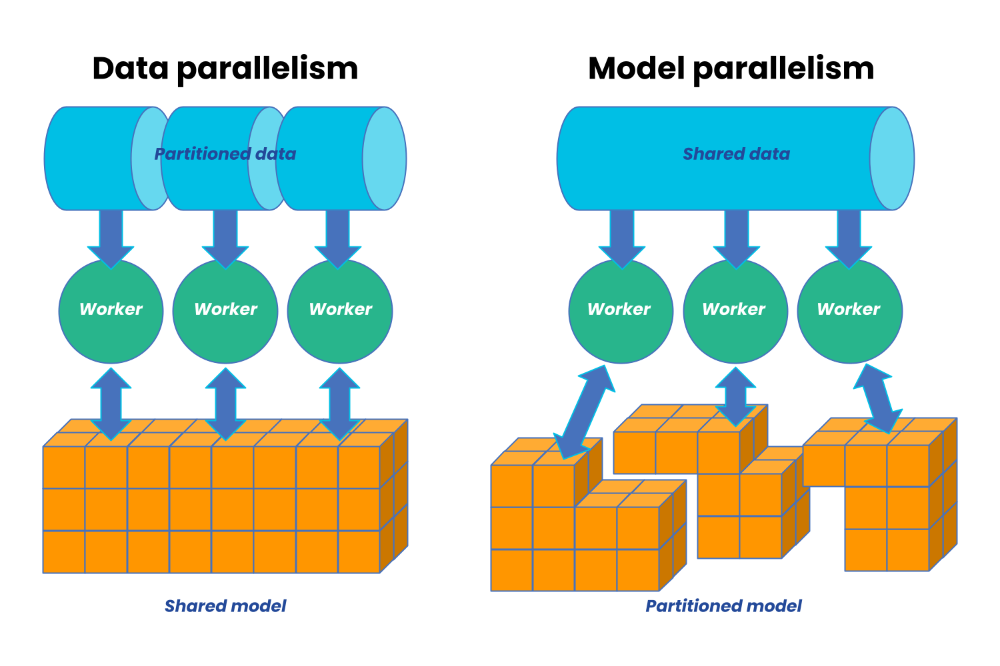

# Chapter 2: What is Distributed Training?

[Chapter 1](01_single_gpu_baseline.md) showed that single-GPU training hits three walls:

a) the model is too large,   
b) training is too slow, or   
c) the input data doesn't fit. 

We also learned [what goes on GPU memory (VRAM) during training](01_single_gpu_baseline.md#what-goes-on-gpu-memory-vram-in-training) in terms of model parameters, activations, gradients, and optimizer state, and why we need to scale out to multiple GPUs to break through these walls.

Distributed training strategies are techniques to break through these walls by splitting the work across multiple GPUs. Each strategy has different tradeoffs in terms of what it splits (data, model, or both), how it communicates between GPUs, and how much memory it saves. It is important to remember that not all of these strategies are relevant to every use case or model architecture. 

This chapter gives an overview of the distributed training strategies we'll cover in the rest of the guide, and how they relate to these walls.

## Distributed Training Paradigms

There are technically two main paradigms for distributed training: **data parallelism** and **model parallelism**. 

Image from AnyScale

Data parallelism is when we divide our training data across our available workers and run a copy of the model on each worker. Each worker then runs a different fragment of the data on the same model. 

In contrast, model parallelism is when we divide our model across different workers, with each worker running the same data on a different segment of the model.

In practice, there are many flavors of both data and model parallelism, and there are also hybrid approaches that combine both. The most common strategies are summarized in the table below, and we'll cover each one in detail in the following chapters:

| Strategy | What's Split | Communication Pattern | Memory Savings | Chapters |
|----------|-------------|----------------------|----------------|----------|
| **DDP** | Data (batches) | All-reduce (gradients) | None (full model copy) | [Ch 4](04_data_parallel_ddp.md) |
| **FSDP** | Params + grads + optimizer | All-gather + reduce-scatter | High | [Ch 5](05_fully_sharded_fsdp.md) |
| **TP** | Weight matrices (within layers) | All-reduce + all-gather (per layer) | Medium | [Ch 6](06_tensor_parallel.md) |
| **PP** | Model layers (depth) | Send/recv (activations between stages) | Medium–High | [Ch 7](07_pipeline_parallel.md) |
| **SP** | Sequence dimension | All-gather / reduce-scatter / all-to-all | Medium | [Ch 8](08_sequence_parallel.md) |
| **Domain** | Spatial input data | Halo exchange (P2P) | High | [Ch 10](10_domain_parallel.md) |
| **Hybrid** | Multiple of the above | Mixed | Very high | [Ch 9](09_hybrid_parallelism.md) |

## Strategy Previews

### Data Parallel (DDP) — Chapter 4

Distributed Data Parallel (DDP) is PyTorch's standard data parallel implementation and the most common distributed training strategy.
In DDP, every GPU has a full copy of the model but trains on a different slice of data. 
After each backward pass, gradients are averaged across all GPUs with an all-reduce. 
Training speed scales linearly with GPU count. DDP can be used when the model fits in memory but training is too slow, or when you want to increase batch sizes.

### Fully Sharded Data Parallel (FSDP) — Chapter 5

Like DDP, but the model itself is sharded across GPUs. 

Each GPU only stores 1/N of the parameters, gradients, and optimizer state, where N is the number of GPUs. During forward and backward passes, parameters are gathered and gradients are scattered across GPUs using all-gather and reduce-scatter operations. This allows you to train much larger models that don't fit in memory, at the cost of more communication overhead compared to DDP.

In FSDP, the tradeoff is between memory savings and communication overhead.

### Tensor Parallel (TP) — Chapter 6

Splits individual weight matrices across GPUs. A matrix multiply
`Y = XA` becomes two partial multiplies on different GPUs, joined by
an all-reduce. Best for models with very large linear layers (LLMs).
Requires fast GPU interconnect.

### Pipeline Parallel (PP) — Chapter 7

Assigns different layers to different GPUs. GPU 0 runs layers 1-20,
GPU 1 runs layers 21-40, etc. The challenge is keeping all GPUs busy —
solved by splitting each batch into micro-batches and pipelining them.

### Sequence Parallel (SP) — Chapter 8

Splits the sequence dimension across GPUs. Important for long-context
transformers where attention memory scales as O(n^2). Three approaches
exist: Megatron-SP, DeepSpeed-Ulysses, and Ring Attention.

### Domain Parallel — Chapter 10

Unique to scientific computing. Splits spatial input data (images, grids,
meshes) across GPUs. Each GPU processes a tile and exchanges boundary
data ("halos") with neighbors. Essential for high-resolution climate and
weather models.

### Hybrid Parallelism — Chapter 9

For the largest models, you combine strategies. The most common pattern:
TP within a node (fast local communication) + FSDP across nodes
(parameter sharding over the network). This is how large language models
are trained in practice.

## What's Next?

Before we can implement any of these strategies, we need to understand
*how GPUs communicate*. Chapter 3 covers ranks, process groups, and the
five collective operations that underpin everything.

**Next:** [Chapter 3 — Communication Primitives](03_communication_primitives.md)
