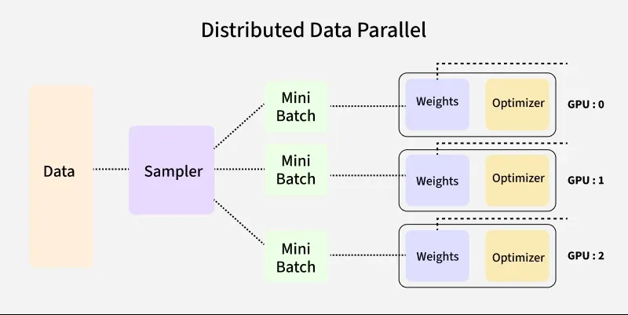

# Distributed Data Parallel (DDP)

Data Parallel is the most common distributed training strategy and usually the first one you should try when scaling up your training workflows. The idea is simple: every GPU has a complete copy of the full model, but each processes a different slice of the data, because data doesn't fit on one GPU or training is too slow. 

PyTorch DistributedDataParallel (DDP) is the standard implementation of this strategy.

DDP works by running one process per GPU, where:  
- Each process has its own full copy of the model   
- Each process computes forward and backward passes on its own batch (shard) of data  
- Gradients are averaged across all processes using an efficient collective   communication operation called `all-reduce` after each backward pass, ensuring that all model replicas remain in sync.  

DDP is PyTorch's recommended approach and easiest to implement for multi-GPU training and works across both single-node and multi-node setups.

!!! info "what is `all-reduce`?"
    `all-reduce` is a collective communication operation that takes tensors from all processes, performs a reduction (e.g., sum) across them, and then distributes the result back to all processes. In DDP, it's used to average gradients across GPUs after the backward pass, ensuring that each model replica has the same updated parameters before the next optimization step. Read more about `all-reduce` in the [PyTorch Collective Communication chapter](03_collective_communication.md#all-reduce).


*Figure 1: DDP replicates the full model on each GPU and averages gradients across GPUs after backward pass (Image from Medium)*
## How DDP Works?

1. **Model Replication**: Each GPU gets a full copy of the model
2. **Data Distribution**: Training data is split across GPUs using `DistributedSampler` to ensure each GPU processes a unique subset of the data
3. **Forward Pass**: Each GPU processes its batch independently
4. **Gradient Sync**: During backward propagation, gradients are averaged across all GPUs using `all-reduce` operation (typically via NCCL backend for GPUs)
5. **Parameter Update**: All GPUs update their parameters and after synchronization, each model replica remains identical.


Each GPU computes gradients independently, then participates in an all-reduce operation to ensure all model replicas remain identical before the next optimization step.

## How to modify your training script for DDP?

There are only a few changes needed to convert a single-GPU training script to DDP.  

The main steps are:  
1. Initialize the distributed process group  
2. Set the device for each process using `local_rank`  
3. Wrap your model with `DistributedDataParallel`  
4. Use `DistributedSampler` for your dataset to ensure proper data sharding  
5. Set the epoch on the sampler at the start of each epoch to ensure different shuffling each epoch.    
6. Keep the training loop the same (zero_grad → forward → backward → step)  
7. Clean up the process group at the end of training.  

### 1. Initialize the process group:
Each DDP process needs to initialize the process group for communication. This is typically done at the start of your script:
```python
import torch.distributed as dist
dist.init_process_group(backend="nccl") 
```

!!! tip
    The launcher (e.g., `torchrun`) will set `LOCAL_RANK`, `WORLD_RANK` and `WORLD_SIZE` to a unique value for each process, allowing you to assign each process to a different GPU. For example, if you have 4 GPUs, the processes will have `LOCAL_RANK` values of 0, 1, 2, and 3, which correspond to the GPU IDs.

!!! tip "Using MPI-based launchers"
    The utility functions in `utils/distributed.py` can help with this setup and also provides a `setup_distributed()` function that initializes the process group and sets the device for you based on the environment variables with different launchers (e.g., `torchrun`, `mpiexec`, etc.). You can call this function at the start of your training script to handle the distributed setup.
    see the scripts in `scripts/01_data_parallel_ddp/` for examples of how to use MPI-based launchers with PyTorch DDP.

### 2. Set the device for each process:
Each process should set its device based on the `LOCAL_RANK` environment variable, which is automatically set by the launcher:
```python
import os
local_rank = int(os.environ["LOCAL_RANK"])
torch.cuda.set_device(local_rank)
```

### 3. Wrap your model with `DistributedDataParallel`:
The DDP wrapper automatically synchronizes gradients across all GPUs during the backward pass. Move the model to the device before wrapping.

```python
from torch.nn.parallel import DistributedDataParallel as DDP
model = model.to(LOCAL_RANK)
model = DDP(model, device_ids=[LOCAL_RANK])
```

### 4. Use `DistributedSampler` for your dataset:

To ensure that each GPU processes a unique subset of the data, use `DistributedSampler`, which partitions the dataset across the GPUs.

```python
from torch.utils.data.distributed import DistributedSampler
train_loader = DataLoader(
        train_dataset,
        sampler=DistributedSampler(train_dataset),
        batch_size=batch_size,
        shuffle=False,                          # shuffle is handled by the sampler
        pin_memory=True,
        ...)
```

!!! note "DistributedSampler"
    The `DistributedSampler` ensures each GPU sees a **non-overlapping**
    subset of the data:
    

    Two important details when using `DistributedSampler`:

    1. **Set `shuffle=False` in DataLoader** — the sampler handles shuffling by setting the epoch, so you don't want the DataLoader to shuffle as well.
    2. **Call `sampler.set_epoch(epoch)`** at the start of each epoch.
       Without this, every epoch uses the same shuffle order, which hurts
       convergence.

### 5. Destroy the process group at the end of training:

Destroy the process group to clean up resources:
```python
dist.destroy_process_group()
```

## Effective Batch Size
With DDP, each GPU processes `batch_size` samples per step. The effective batch size is:

```
effective_batch_size = per_gpu_batch_size × world_size
```

If you use `batch_size=64` on 1 GPU,  then on 4 GPUs, your effective batch size is 256.
This matters for learning rate scheduling — you may need to scale the learning rate accordingly (linear scaling rule: `lr × world_size`).

## Common Pitfalls

### Printing on all ranks

Without guarding print statements, you get 4 copies of every log line:

```python
# Bad: prints on all GPUs
print(f"Loss: {loss.item()}")

# Good: only rank 0 prints
if dist.get_rank() == 0:
    print(f"Loss: {loss.item()}")
```

### Forgetting `set_epoch()`
The `DistributedSampler` shuffles data differently each epoch based on the epoch number. If you forget to call `set_epoch()`, every epoch will have the same shuffle order, which can hurt convergence:

```python
# Bad: same data order every epoch
for epoch in range(num_epochs):
    for data, target in train_loader:
        ...

# Good: different shuffle each epoch
for epoch in range(num_epochs):
    train_sampler.set_epoch(epoch)
    for data, target in train_loader:
        ...
```

### Saving checkpoints from all ranks

If every process saves a checkpoint, you will end up with duplicated files and potential corruption.

```python
# Bad: every rank writes a checkpoint
torch.save(model.state_dict(), "checkpoint.pt")

# Good: only rank 0 writes
if dist.get_rank() == 0:
    torch.save(model.state_dict(), "checkpoint.pt")
```

!!! tip "Saving full model with DDP"
    The above example only saves the local state dict on each GPU, which is not the full model. To save the full model, you can use `model.module.state_dict()` to access the underlying model's state dict.

### Manually sending tensors between GPUs

Not using `pin_memory` and `non_blocking=True` in your DataLoader can lead to slow data transfers between CPU and GPU. Always use these options for optimal performance.

```
train_loader = DataLoader(
    train_dataset,
    batch_size=batch_size,
    shuffle=True,
    pin_memory=True,
)

for data, target in train_loader:
    data = data.to(device, non_blocking=True)
    target = target.to(device, non_blocking=True)

```

### Uneven batch sizes across GPUs

If the dataset size is not divisible by `WORLD_SIZE`, some ranks may receive fewer samples. This can lead to:

- Imbalanced workloads across GPUs  
- Incorrect gradient averaging  
- Potential hangs or errors in synchronization  

!!! note
    `DistributedSampler` handles this by default by either:
    - **Padding samples** (default behavior) so that each rank has the same number of samples  
    - **Dropping extra samples** when `drop_last=True`  

    This ensures that all ranks process the same number of batches and stay in sync.




!!! info
[PyTorch DataLoader documenation](https://docs.pytorch.org/docs/stable/data.html#single-and-multi-process-data-loading) has more details on all knobs and options for `DistributedSampler` and how it handles shuffling, padding, and dropping samples.


???+ tip "DDP Best Practices"
    Here are some easy tips to get the best performance out of DDP:

    - **Use mixed precision (FP16/BF16)** → faster + lower memory 
    - **Keep GPUs busy** → check utilization (`nvitop` or `nvidia-smi`) before scaling  
    - **Tune DataLoader**
        - `num_workers ≈ num_gpus × 4`  
        - `pin_memory=True`, `persistent_workers=True`  
    - **Use `DistributedSampler` correctly**
        - `shuffle=False` in DataLoader  
        - call `sampler.set_epoch(epoch)`  
    - **Scale batch size with GPUs** → adjust learning rate if needed  
    - **Use NCCL + good network config** for fast communication  
    - **Log/checkpoint only on rank 0** to avoid duplication and corruption

## When to Use DDP

**Use DDP when:**  
- Your model fits on a single GPU with `batch_size > 1` but training is too slow.  
- You want to train faster by using more GPUs   
- You want near-linear scaling with GPU count    

**Move beyond DDP when:**   
- Your model doesn't fit on a single GPU → Chapter 5 (FSDP)   
- Individual layers are too large → Chapter 6 (TP)   
- You have hundreds of layers → Chapter 7 (PP)   
- Your input data is too large, even for `batch_size=`→ Chapter 10 (Domain Parallelism)     

## Running the Examples

```bash
# Single node, 4 GPUs
torchrun --standalone --nproc_per_node=4 \
    scripts/01_data_parallel_ddp/multinode_ddp_basic.py

# Multi-node (2 nodes, 4 GPUs each)
mpiexec -n 8 --ppn 4 --cpu-bind none \
    python scripts/01_data_parallel_ddp/multinode_ddp_basic.py

# DistributedSampler / DataLoader patterns
torchrun --standalone --nproc_per_node=4 \
    scripts/01_data_parallel_ddp/distributed_dataloader.py

# Multi-node via PBS job script
qsub scripts/01_data_parallel_ddp/torchrun_multigpu_ddp.sh
```

**See also:**  
- [`scripts/01_data_parallel_ddp/README.md`](../../scripts/01_data_parallel_ddp/README.md) — full DDP guide with files, PBS instructions, and troubleshooting    
- [`scripts/01_data_parallel_ddp/multinode_ddp_basic.py`](../../scripts/01_data_parallel_ddp/multinode_ddp_basic.py) — minimal DDP example with synthetic data 
- [`scripts/01_data_parallel_ddp/distributed_dataloader.py`](../../scripts/01_data_parallel_ddp/distributed_dataloader.py) — DistributedSampler patterns    

## References

- [PyTorch DDP Tutorial](https://pytorch.org/tutorials/intermediate/ddp_tutorial.html)
- [PyTorch Distributed Overview](https://pytorch.org/tutorials/beginner/dist_overview.html)
- [Getting Started with PyTorch Distributed](https://medium.com/red-buffer/getting-started-with-pytorch-distributed-54ae933bb9f0)


## What's Next?

DDP requires every GPU to hold the full model. When that's no longer possible, FSDP shards the model itself across GPUs.

**Next:** [Chapter 5 — Fully Sharded Data Parallel (FSDP)](05_fully_sharded_fsdp.md)
