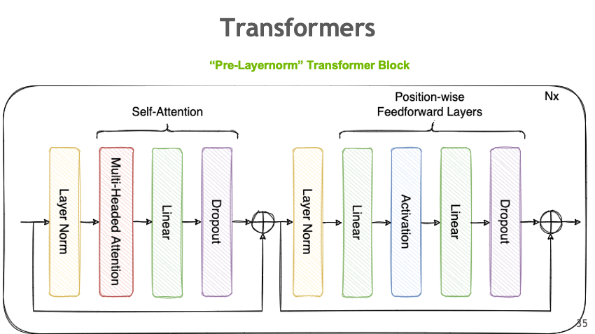

# Chapter 6: Tensor Parallel (TP)

Tensor Parallelism (TP) is a model-parallel partitioning method that distributes the parameter tensor of an individual layer across GPUs. In addition to reducing model state memory usage, it also saves activation memory as the per-GPU tensor sizes shrink. However, the reduced per-GPU tensor size increases CPU overhead due to smaller per-GPU kernel workloads.

While FSDP shards whole parameters and reconstructs them before use, TP keeps
each GPU's shard in place and computes partial results that are combined
with a collective operation.


*Figure 1: Tensor Parallelism distributes individual layer parameters across multiple GPUs.*

## How It Works

TP partitions large weight matrices across GPUs. For a linear layer `Y = XW`, there are two fundamental approaches:

### Column-Parallel Linear

The weight matrix is split along columns across GPUs. Each GPU receives an identical copy of the input and performs matrix multiplication on its column shard. The partial outputs are then concatenated via an all-gather operation.


*Figure 2: Column-wise parallel splits the weight matrix W along columns. Each GPU computes a partial output, then results are gathered.*

### Row-Parallel Linear

The weight matrix is split along rows across GPUs. The input is divided along the inner dimension so each GPU has a corresponding shard. Each GPU computes a partial result, and outputs are combined via an all-reduce summation.


*Figure 3: Row-wise parallel splits the weight matrix W along rows. Each GPU computes a partial sum, then results are reduced.*

### Combined Column + Row Parallelism

In practice, sequential linear layers (e.g., in an MLP block) use both methods together. The column-wise output feeds directly into the row-wise layer **without any data transfer between GPUs**. Element-wise operations like activation functions also apply without communication overhead. This is the key insight from the [Megatron-LM paper](https://arxiv.org/abs/1909.08053).


*Figure 4: Combined approach pairs column-wise and row-wise parallelism to minimize communication to a single all-reduce per block.*


## PyTorch TP API

PyTorch provides `DeviceMesh` and `parallelize_module` for TP:

```python
from torch.distributed.device_mesh import init_device_mesh
from torch.distributed.tensor.parallel import (
    parallelize_module,
    ColwiseParallel,
    RowwiseParallel,
)

# Create a 1D mesh for TP across 4 GPUs
tp_mesh = init_device_mesh("cuda", (4,), mesh_dim_names=("tp",))

# Parallelize specific layers
model = parallelize_module(
    model,
    tp_mesh,
    {
        "ffn.w1": ColwiseParallel(),   # split columns
        "ffn.w2": RowwiseParallel(),   # split rows
        "attn.qkv": ColwiseParallel(), # split Q, K, V projections
        "attn.out": RowwiseParallel(), # combine attention output
    },
)
```

## TP Degree on Derecho

TP requires frequent all-reduces between GPUs. On Derecho, each node
has 4 A100 GPUs connected via NVLink (600 GB/s), so keep TP within a
single node:

```
Derecho: 4 GPUs per node, NVLink (600 GB/s)

Recommended: TP degree = 4 (one full node)

Going beyond TP=4 puts TP communication on the slower Slingshot
fabric, which hurts throughput.
```

For larger models, combine TP with FSDP across nodes (Chapter 9).

## 1D vs 2D Tensor Parallelism

**1D TP** splits weight matrices along one dimension (columns or rows),
as shown above.

**2D TP** splits along both dimensions using a 2D GPU grid. This reduces
communication volume but requires more GPUs. With 4 GPUs in a 2×2 grid:

```
Weight matrix A [K × N]:

     GPU (0,0)     GPU (0,1)
   ┌───────────┬───────────┐
   │ A[0:K/2,  │ A[0:K/2,  │
   │   0:N/2]  │   N/2:N]  │
   ├───────────┼───────────┤
   │ A[K/2:K,  │ A[K/2:K,  │
   │   0:N/2]  │   N/2:N]  │
   └───────────┴───────────┘
     GPU (1,0)     GPU (1,1)

Communication: reduce-scatter along rows, all-gather along columns
```

2D TP reduces the per-GPU communication from O(N) to O(√N) but adds
complexity. See the scripts for a working example.

## Running the Examples

The TP scripts are progressive — start with 01 and work through:

```bash
# Start here: basic TP concepts
torchrun --standalone --nproc_per_node=4 \
    scripts/03_tensor_parallel_tp/01_basic_tensor_parallel.py

# DeviceMesh for organizing GPUs
torchrun --standalone --nproc_per_node=4 \
    scripts/03_tensor_parallel_tp/02_device_mesh_example.py

# 2D tensor parallelism
torchrun --standalone --nproc_per_node=4 \
    scripts/03_tensor_parallel_tp/03_2d_tensor_parallel.py

# Advanced patterns
torchrun --standalone --nproc_per_node=4 \
    scripts/03_tensor_parallel_tp/04_advanced_tp_example.py
```

**See also:**
- [`scripts/03_tensor_parallel_tp/`](../../scripts/03_tensor_parallel_tp/) — progressive TP examples (01 → 04)
- [`scripts/03_tensor_parallel_tp/README.md`](../../scripts/03_tensor_parallel_tp/README.md) — deep dive on TP

## What's Next?

TP splits layers horizontally (by weight matrix). Pipeline Parallelism
splits the model vertically — assigning different layers to different
GPUs.

**Next:** [Chapter 7 — Pipeline Parallel](07_pipeline_parallel.md)
