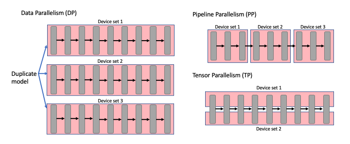
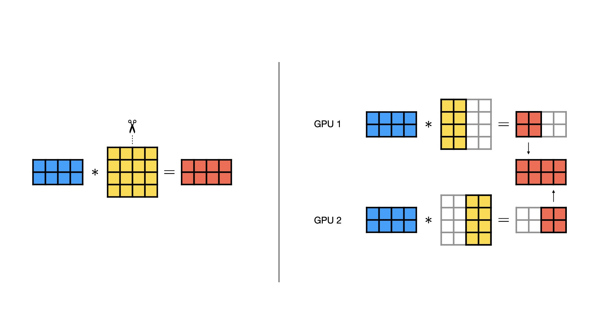
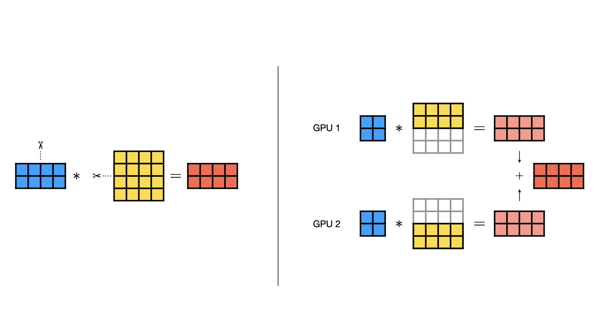
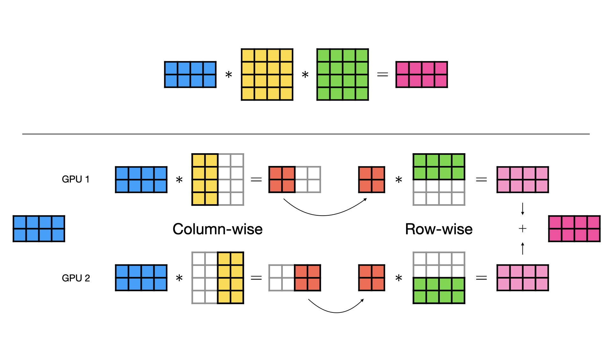

# Chapter 6: Tensor Parallel (TP)

Tensor Parallelism (TP) is a model-parallel partitioning method that distributes the parameter tensor of an individual layer of a model across GPUs. For example, a large weight matrix in a transformer block can be split across 4 GPUs, with each GPU responsible for computing a portion of the output. This allows you to train models with layers that are too large to fit on a single GPU, even if the overall model size is manageable.


<figure markdown="span">
  
  <figcaption>Figure 1: Overview of parallelism modes — Data, Tensor, and Pipeline Parallelism. Tensor Parallelism splits individual layers across GPUs. (Source: robotchinwag.com)</figcaption>
</figure>

While FSDP shards whole parameters and reconstructs them before use, TP keeps
each GPU's shard in place and computes partial results that are combined with a collective operation (i.e. all-reduce for row-parallel, all-gather for column-parallel). 

??? warning "Tradeoff: smaller tensors vs GPU efficiency"

    Splitting tensors across GPUs reduces both model state memory and activation memory, since each GPU works on smaller chunks of data.
    However, smaller per-GPU tensor sizes can lead to lower GPU utilization and increased CPU overhead due to more frequent communication and smaller kernel workloads. This is a key tradeoff in TP, i.e.  you can fit larger layers, but you may not get linear speedup with GPU count.


## How It Works
The key to TP is that matrix multiplication can be executed in parallel by splitting the weight matrix across GPUs. TP partitions large weight matrices across GPUs. For a linear layer `Y = X x W`, there are three fundamental approaches:

### Column-Parallel Linear

The weight matrix is split along columns across GPUs. Each GPU receives an identical copy of the input and performs matrix multiplication on its column shard. The partial outputs are then concatenated via an all-gather operation.

<figure markdown="span">
  
  <figcaption>Figure 3: Column-wise parallel splits the weight matrix W along columns. Each GPU computes a partial output, then results are gathered.</figcaption>
</figure>

### Row-Parallel Linear

The weight matrix is split along rows across GPUs. The input is divided along the inner dimension so each GPU has a corresponding shard. Each GPU computes a partial result, and outputs are combined via an all-reduce summation.

<figure markdown="span">
  
  <figcaption>Figure 4: Row-wise parallel splits the weight matrix W along rows. Each GPU computes a partial sum, then results are reduced.</figcaption>
</figure>

### Combined Column + Row Parallelism

In practice, sequential linear layers (e.g., in an MLP block) use both methods together. The column-wise output feeds directly into the row-wise layer **without any data transfer between GPUs**. Element-wise operations like activation functions also apply without communication overhead. This is the key insight from the [Megatron-LM paper](https://arxiv.org/abs/1909.08053).

<figure markdown="span">
  
  <figcaption>Figure 5: Combined approach pairs column-wise and row-wise parallelism to minimize communication to a single all-reduce per block.</figcaption>
</figure>


## PyTorch TP API

PyTorch provides `DeviceMesh` and `parallelize_module` for TP:

```python
from torch.distributed.device_mesh import init_device_mesh
from torch.distributed.tensor.parallel import (
    parallelize_module,
    ColwiseParallel,
    RowwiseParallel,
)

# Create a 1D mesh for TP across 4 GPUs
tp_mesh = init_device_mesh("cuda", (4,), mesh_dim_names=("tp",))

# Parallelize specific layers
model = parallelize_module(
    model,
    tp_mesh,
    {
        "ffn.w1": ColwiseParallel(),   # split columns
        "ffn.w2": RowwiseParallel(),   # split rows
        "attn.qkv": ColwiseParallel(), # split Q, K, V projections
        "attn.out": RowwiseParallel(), # combine attention output
    },
)
```

## TP Degree on Derecho

TP requires frequent `all-reduce`s or `all-gather`s between GPUs. The **TP degree** is the number of GPUs that collectively hold one layer's weights. On Derecho, each node has 4 A100 40GB GPUs connected via NVLink (600 GB/s bidirectional). This makes the node boundary the natural limit for TP.
 
| TP Degree | Interconnect | All-reduce Cost | Recommendation |
|:---:|:---:|:---:|:---:|
| 4 | NVLink | Low | Max within one Derecho node |
| 8 | NVLink + InfiniBand | High | Crosses node boundary — avoid |
 
!!! warning "Keep TP within a node"
    TP requires an all-reduce at every layer (forward and backward). This is fine over NVLink but slow over InfiniBand. A TP degree of 8 on Derecho means 4 GPUs communicate over NVLink and 4 over HPE Slinggshot -- which results in the slow link dominating. 
 
```python
from torch.distributed.device_mesh import init_device_mesh
 
# TP within node, FSDP across nodes
# Example: 2 nodes × 4 GPUs = 8 GPUs total
# TP degree = 4 (intra-node), FSDP degree = 2 (inter-node)
mesh = init_device_mesh("cuda", (2, 4), mesh_dim_names=("fsdp", "tp"))
 
tp_mesh = mesh["tp"]     # 4 GPUs on same node
fsdp_mesh = mesh["fsdp"] # same local_rank across nodes
```

Chapter 9 (Hybrid Parallelism) covers how to combine TP with FSDP for large models that require both intra-node and inter-node parallelism.

## 1D vs 2D Tensor Parallelism

**1D TP** splits weight matrices along one dimension (columns or rows), as shown above. We learned about this in the above section. 

**2D TP** splits along both dimensions using a 2D GPU grid. This reduces communication volume but requires more GPUs. 

With 4 GPUs in a 2×2 grid:

```
Weight matrix A [K × N]:

     GPU (0,0)     GPU (0,1)
   ┌───────────┬───────────┐
   │ A[0:K/2,  │ A[0:K/2,  │
   │   0:N/2]  │   N/2:N]  │
   ├───────────┼───────────┤
   │ A[K/2:K,  │ A[K/2:K,  │
   │   0:N/2]  │   N/2:N]  │
   └───────────┴───────────┘
     GPU (1,0)     GPU (1,1)

```

2D TP reduces the per-GPU communication from O(N) to O(√N) but adds complexity in process-group management, data layout, synchronization, and implementation overhead. In practice, this means better scalability at large GPU counts, but a more complicated setup than 1D TP. See the scripts for a working example.. See the scripts for a working example.

## When to Use Tensor Parallelism

You should use TP when:

- A **single layer is too large** to fit on one GPU  
- FSDP still fails due to **temporary all-gather OOMs**  
- You are training **large Transformer-style models**  

!!! warning "Communication-heavy strategy"
    TP introduces synchronization inside every layer, making it much more sensitive to network performance
    than DDP or FSDP. Avoid  TP if your GPUs are not connected via high-speed interconnect (e.g., NVLink).

## Running the Examples

The TP scripts are progressive — start with 01 and work through:

```bash
# Start here: basic TP concepts
torchrun --standalone --nproc_per_node=4 \
    scripts/03_tensor_parallel_tp/01_basic_tensor_parallel.py

# DeviceMesh for organizing GPUs
torchrun --standalone --nproc_per_node=4 \
    scripts/03_tensor_parallel_tp/02_device_mesh_example.py

# 2D tensor parallelism
torchrun --standalone --nproc_per_node=4 \
    scripts/03_tensor_parallel_tp/03_2d_tensor_parallel.py

# Advanced patterns
torchrun --standalone --nproc_per_node=4 \
    scripts/03_tensor_parallel_tp/04_advanced_tp_example.py
```

**See also:**
- [`scripts/03_tensor_parallel_tp/`](../../scripts/03_tensor_parallel_tp/) — progressive TP examples (01 → 04)
- [`scripts/03_tensor_parallel_tp/README.md`](../../scripts/03_tensor_parallel_tp/README.md) — deep dive on TP

## What's Next?

TP splits layers horizontally (by weight matrix). Pipeline Parallelism
splits the model vertically — assigning different layers to different
GPUs.

**Next:** [Chapter 7 — Pipeline Parallel](07_pipeline_parallel.md)
