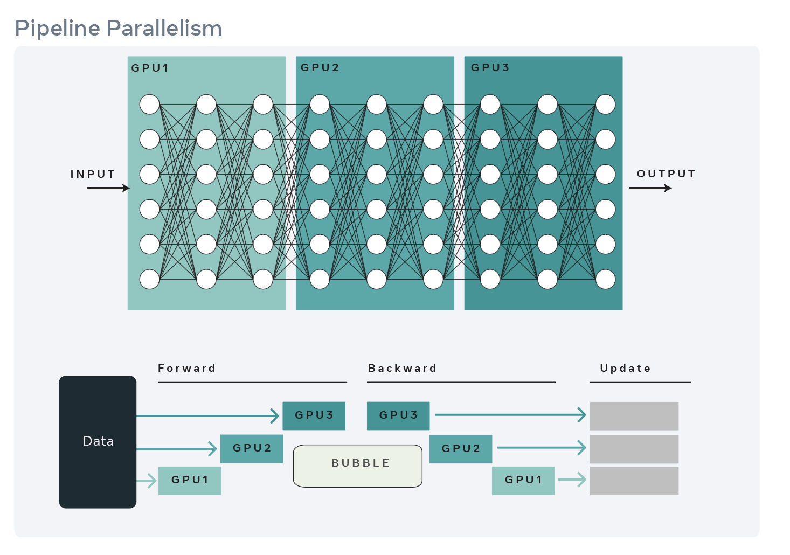
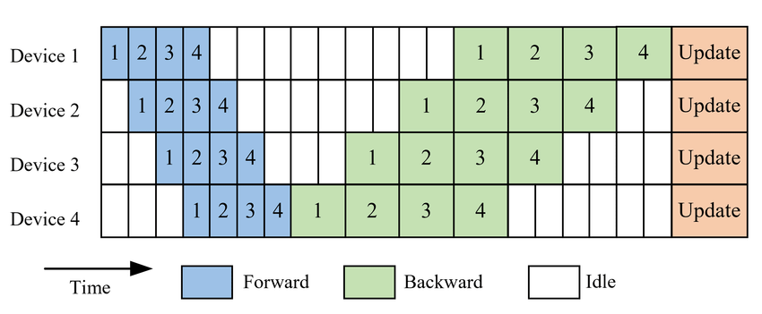
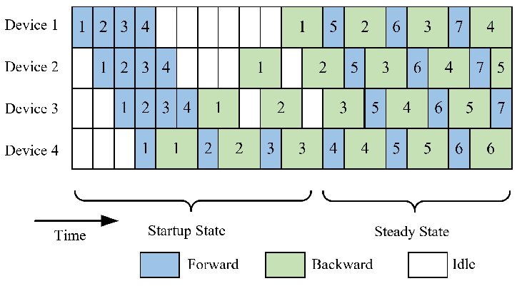
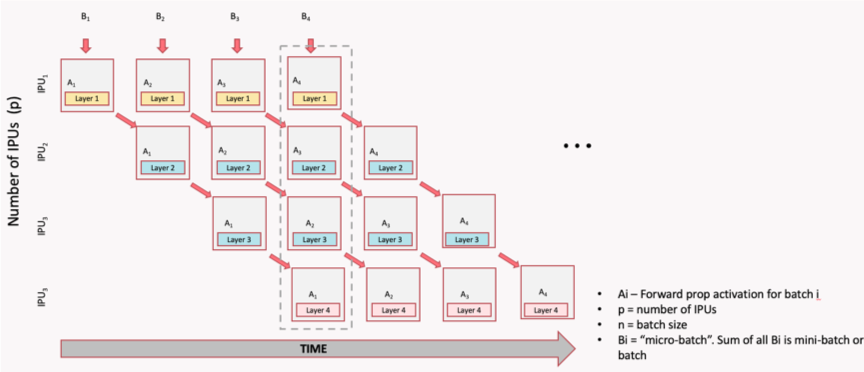

# Chapter 7: Pipeline Parallel (PP)

Pipeline Parallelism splits a model **by depth (or model layers)**; so different GPUs own different layers. GPU 0 runs layers 1-20, GPU 1 runs layers 21-40, and
so on. 

This is ideal for very deep models that don't fit on one GPU, but it can be used for any model with many layers.



Note that pipeline parallelism can increase the total latency for each request because of communication between different pipeline stages.

Pipeline parallelism is often used in combination with other strategies — for example, you might use TP to split each layer across 4 GPUs, and then PP to split the depth across 4 more GPUs, for a total of 16 GPUs.


## Pipeline Bubble Problem

In a naive pipeline, because each GPU depends on the output of the previous one, some devices may be idle at times, which means resource underutilization. To reduce these idle periods, the input batch can be split into smaller microbatches.

Each microbatch is processed through the pipeline, allowing different stages to work on different microbatches simultaneously. This technique helps to keep all GPUs busy and reduces the idle time (or "pipeline bubbles"), improving overall efficiency and reducing the idle time. However, it also increases memory usage because activations for multiple microbatches must be stored at once.

## Typical Implementations of Pipeline Parallelism
There are four common implementations of pipeline parallelism, each with different tradeoffs:
- GPipe: all forwards, then all backwards (high memory)  
- PipeDream: introduces asynchronous execution to reduce bubbles (but can cause staleness)  
- PipeDream-2BW: Optimizes memory and communication by using 2 weight buffers -- 2-Backward-Weight that reduces staleness  
- PipeDream Flush (1F1B): implements the 1F1B (One Forward, One Backward) scheduling strategy to reduce pipeline bubbles and improve efficiency.  

### GPipe

All forwards first, then all backwards. Simple but requires storing
activations for all micro-batches simultaneously (high memory), and has a large bubble (idle time) between forward and backward passes.

The illustration below shows the forward and backward passes for 4 stages and 4 micro-batches. The forward pass processes all micro-batches sequentially, followed by the backward pass, which also processes all micro-batches sequentially. This results in a bubble fraction of 75%, meaning that 75% of the time, some GPUs are idle.




### 1F1B (One Forward, One Backward)
1F1B is a pipeline parallelism scheduling strategy that interleaves forward and backward passes across microbatches to reduce the "pipeline bubble". In 1F1B, each stage starts backward as soon as possible, reducing peak activation memory and bubble time. This is the most efficient schedule in practice.

The image below illustrates the 1F1B schedule for 4 stages and 4 micro-batches in PipeDream. In this schedule, as soon as the first micro-batch completes its forward pass on GPU 0, it immediately starts its backward pass while GPU 0 begins processing the second micro-batch. This interleaving continues, allowing for a much smaller bubble fraction of 12.5%, meaning that only 12.5% of the time, some GPUs are idle.



1F1B is preferred in practice because it uses less memory with the same
bubble overhead.

## How Stages Communicate

In pipeline parallelism, the model is split into sequential chunks **(stages)**, each assigned to a different GPU (or group of GPUs). 

The stages need to pass activations forward and gradients backward, and this happens through point-to-point (P2P) communication — specifically `torch.distributed.send()` and `torch.distributed.recv()` (or their async variants `isend`/`irecv`).


Pipeline parallelism uses **point-to-point send/recv** between adjacent
stages:

<figure markdown="span">
  
  <figcaption>Illustration of pipeline parallelism showing how stages communicate via point-to-point send/recv between adjacent GPUs. (Source: <a href="https://afmck.in/posts/2023-02-26-parallelism/">afmck.in</a>)</figcaption>
</figure>

!!! note
    In pipeline parallelism, communication is between **pairs** of GPUs, not all GPUs at once. This is different from DDP/FSDP (all-reduce, all-gather). Each stage only communicates with its immediate neighbors, which can reduce communication overhead compared to strategies that require global synchronization. However, it also means that the pipeline can be more sensitive to imbalances between stages, which is why micro-batching and scheduling strategies like 1F1B are important to keep all stages busy.

## Manual Pipeline Splitting

Manual pipeline splitting is the simplest form of pipeline parallelism. You assign different layers to different GPUs by hand and explicitly move tensors between devices in the forward pass.
Here's a simple example with two stages:

```python
class Stage0(nn.Module):
    """Layers 0-9, runs on GPU 0."""
    def __init__(self):
        super().__init__()
        self.layers = nn.Sequential(*[layer() for _ in range(10)])

    def forward(self, x):
        return self.layers(x)

class Stage1(nn.Module):
    """Layers 10-19, runs on GPU 1."""
    def __init__(self):
        super().__init__()
        self.layers = nn.Sequential(*[layer() for _ in range(10)])

    def forward(self, x):
        return self.layers(x)

# Place on different GPUs
stage0 = Stage0().to("cuda:0")
stage1 = Stage1().to("cuda:1")

# Forward: stage0 → transfer → stage1
x = stage0(input.to("cuda:0"))
x = x.to("cuda:1")  # explicit transfer
output = stage1(x)
```

This approach makes the data flow explicit but requires manual send/recv
for backward and micro-batch scheduling.

## PyTorch Pipeline API

For production use, PyTorch provides `torch.distributed.pipelining`:

```python
from torch.distributed.pipelining import SplitPoint, pipeline, ScheduleGPipe

# Define where to split the model
pipe = pipeline(
    model,
    mb_args=(micro_batch,),
    split_spec={
        "layers.10": SplitPoint.BEGINNING,  # start stage 1 here
        "layers.20": SplitPoint.BEGINNING,  # start stage 2 here
    },
)

# Choose a schedule
schedule = ScheduleGPipe(pipe, n_microbatches=8)

# Run the pipeline
output = schedule.step(input)
```

## Bubble Fraction Formula
The **bubble fraction** quantifies how much time GPUs spend idle due to the pipeline fill and drain phases. It's the single most important metric for evaluating pipeline parallelism efficiency.
 

```
bubble_fraction = (num_stages - 1) / num_micro_batches
```

| Stages | Micro-batches | Bubble |
|--------|--------------|--------|
| 2 | 8 | 12.5% |
| 4 | 8 | 37.5% |
| 4 | 16 | 18.8% |
| 4 | 32 | 9.4% |
| 8 | 32 | 21.9% |

Rule of thumb: use at least 4× as many micro-batches as stages.

## When to Use PP

**Use PP when:**
- Your model has many layers and is too deep for one GPU
- The layers are roughly uniform in size (balanced stages)
- You can use enough micro-batches to keep the bubble small

**Prefer other strategies when:**
- Individual layers are too large (use TP instead)
- Your model easily fits with FSDP (simpler to implement)
- You have very few layers (not enough to split meaningfully)


## What's Next?

So far we've split data (DDP), parameters (FSDP), weight matrices (TP),
and layers (PP). But what about the input itself? When sequences are too
long for one GPU, Sequence Parallelism splits the sequence dimension.

**Next:** [Chapter 8 — Sequence Parallel](08_sequence_parallel.md)
