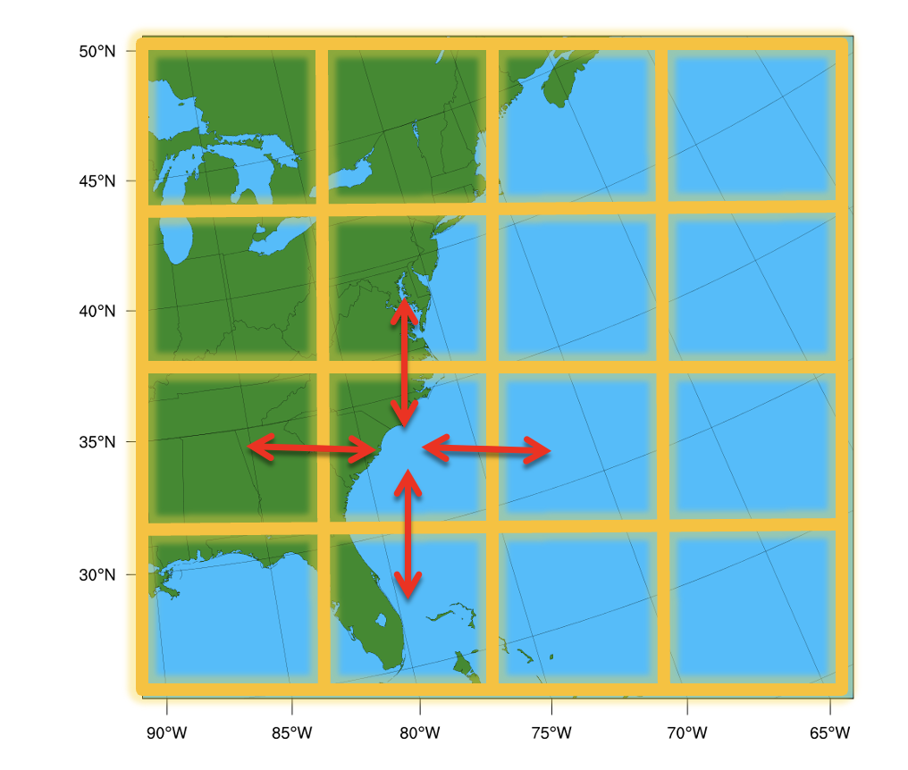

# Chapter 10: Domain Parallel

Domain Parallelism (also called spatial parallelism or domain decomposition) distributes different regions of a single input sample across multiple GPUs so they can be processed simultaneously.

This technique is particularly useful for scientific AI workloads such as weather, climate, and physics simulations where inputs are extremely large multi-dimensional grids.

Instead of giving each GPU a different training sample (as in data parallelism), multiple GPUs cooperate to process one sample. Each GPU handles a different "tile" of the spatial input, and they exchange boundary data ("halos") to ensure correct results at tile edges.

This is directly inspired by **domain decomposition** methods used in classical numerical weather prediction (NWP) for decades. Models like [WRF](github) have long divided the globe into spatial subdomains, assigning each to a different processor. Domain parallelism brings this same idea to deep learning. To learn about WRF domain decomposition, see [this repo](https://github.com/negin513/wrf-proc-finder).

### Why Domain Parallel?
In LLMs, GPU memory is dominated by model parameters (billions of weights). In scientific AI, the situation is reversed —> models are often small (a few million parameters), but **activations dominate memory** because the input data is spatially massive.

!!! note "What goes on to the GPU memory?"
    During training, GPU memory is consumed by four things:   
    1. **Model parameters** — small for most scientific models   
    2. **Active data** (inputs/outputs) — large at high resolution    
    3. **Optimizer states** (gradients, moments) — proportional to parameters   
    4. **Intermediate activations** — saved for the backward pass, proportional to *both* model depth and input resolution   

    As layers stack up, activation memory grows with depth *and* resolution.
    A U-Net on a 1024x1024 grid can easily require 10-100x more activation
    memory than parameter memory. This is why DDP and FSDP alone aren't
    enough — they shard parameters and gradients, not activations. Domain
    parallelism is the only strategy that addresses activation memory.

    Also, read [Chapter 1](01_single_gpu_baseline.md#what-goes-on-gpu-memory-vram-in-training) for a detailed breakdown of GPU memory usage.

## Why Domain Parallel?

Consider a domain with 1440×1440 grids and 100+ vertical levels. A single forward pass through a model on this grid might need 100+ GB of activation memory, which is far more than a single GPU can hold.

Domain parallelism splits the grid into tiles, each processed by a different GPU. Each GPU only needs to store activations for its tile, reducing memory requirements by 1/N for N GPUs. 

<figure markdown="span">
  { width="500" }
  <figcaption>Domain decomposition of a geographic grid into spatial tiles. Red arrows show halo exchange between neighboring subdomains.</figcaption>
</figure>


!!! tip "When to use domain parallelism?"
    Domain parallelism is the best fit when your input is so large that even  `batch_size=1` doesn't fit, and your model uses spatial operations
     (convolutions, normalizations, attention, pooling).


### What is Halo Exchange?

A convolution requires a neighborhood of pixels (the stencil) defined by the kernel size $K$. When the domain is sharded, pixels at the boundary lack the data needed for calculation. To resolve this, a "halo" or "ghost zone" is established—an overlapping region synchronized between neighboring processors . Before each convolution, GPUs exchange their boundary data with neighbors so that each GPU has the necessary context to compute correct outputs at tile edges. This communication pattern is called a **halo exchange**.

```
Naive split (3×3 convolution):

GPU 0 tile              GPU 1 tile
┌─────────┐            ┌─────────┐
│ · · · · │ ← border → │ · · · · │
│ · · · · │            │ · · · · │
│ · · · x │            │ x · · · │
└─────────┘            └─────────┘
        ▲                ▲
        │                │
    This pixel           This pixel
    needs data           needs data
    from GPU 1           from GPU 0

Without the neighbor's data, border pixels get wrong values.
```

You can demonstrate this on a single device in PyTorch:

```python
import torch

full_image = torch.randn(1, 8, 1024, 1024)
left_image  = full_image[:, :, :512, :]
right_image = full_image[:, :, 512:, :]

conv = torch.nn.Conv2d(8, 8, 3, stride=1, padding=1)

full_output  = conv(full_image)
left_output  = conv(left_image)
right_output = conv(right_image)
recombined   = torch.cat([left_output, right_output], dim=2)

torch.allclose(full_output, recombined)  # False!
```

Inspecting where the outputs disagree reveals the problem is exactly at
pixels 511 and 512 along the height dimension — right where the data was
split. The convolution can't see across the border.

The fix is to exchange the missing border row before convolving:

```python
# Pad each half with 1 row from the neighbor (this is a halo exchange)
padded_left  = torch.cat([left_image, right_image[:, :, 0:1, :]], dim=2)
padded_right = torch.cat([left_image[:, :, -1:, :], right_image], dim=2)

# Conv on padded data, then trim the extra output pixels
left_output  = conv(padded_left)[:, :, :-1, :]
right_output = conv(padded_right)[:, :, 1:, :]
recombined   = torch.cat([left_output, right_output], dim=2)

torch.allclose(full_output, recombined)  # True!
```

This manual padding is exactly what **halo exchange** automates across GPUs.


[domain](https://discourse.julialang.org/t/ann-mpihaloarrays-jl/77385)


## Practical Implementation

### PyTorch's `DTensor` 
PyTorch DTensor (Distributed Tensor) provides sharding primitives that transparently handle distributed logic using the Single Program, Multiple Data (SPMD) model. It supports Shard(dim), Replicate(), and Partial() placements on a DeviceMesh.

#### Option B: NVIDIA PhysicsNeMo ShardTensor (Recommended)
PhysicsNeMo introduces ShardTensor, which extends DTensor by tracking the shape of each local tensor along sharding axes . This is critical for uneven sharding in irregular domains like point clouds or non-rectangular grids. It intercepts operations at the functional level to route local computations and trigger necessary communication .
[ShardTensor](https://docs.nvidia.com/physicsnemo/user-guide/latest/physicsnemo-distributed/domain-parallelism/shard-tensor.html)
(built on PyTorch's DTensor) automates what we did manually above.
Instead of hand-coding halo exchanges and gradient communication:

- **Automatic halo exchange** — operations are intercepted at the functional
  level; communication happens transparently without manual padding or send/recv
- **Correct gradients** — `mean().backward()` on a ShardTensor automatically
  distributes gradients to their proper sharding
- **Irregular data support** — unlike DTensor's uniform `torch.chunk`,
  ShardTensor handles meshes, point clouds, and unevenly-distributed domains

Under the hood, ShardTensor extends PyTorch's DTensor with:

- A specification that tracks the shape of each local tensor along sharding
  axes (critical for non-uniform data like point clouds)
- A dispatcher that intercepts operations at the functional level (higher
  than DTensor's dispatch level), falling back to DTensor when no custom
  implementation exists
- Dedicated `sum` and `mean` reductions that correctly intercept and
  distribute gradients

Domain parallelism with ShardTensor performs best when:

- GPU kernels are **large** (big input data) — the communication-to-compute ratio stays small
- GPU kernels are **non-blocking** — the slightly higher overhead of domain parallelism still fills the GPU queue efficiently


Supported layers include convolutions, normalizations, upsampling/pooling, and attention layers. ShardTensor intercepts operations at the dispatch level and inserts the necessary communication.


PhysicsNeMo provides `ShardTensor`, a high-level abstraction built on PyTorch's `DTensor` that handles domain parallelism with minimal code changes:
```python
import torch
import torch.nn as nn
from physicsnemo.distributed import DistributedManager
from physicsnemo.distributed.shard_tensor import ShardTensor
from torch.distributed.device_mesh import init_device_mesh

# Initialize distributed
DistributedManager.initialize()
dm = DistributedManager()

# Create a 2D device mesh: [data_parallel, domain_parallel]
# e.g., 8 GPUs total = 2 data-parallel × 4 domain-parallel
mesh = init_device_mesh("cuda", (2, 4), mesh_dim_names=("dp", "spatial"))

# Your model — no modifications needed if using supported layers
model = MyWeatherModel()

# Distribute input: shard along the latitude dimension
# ShardTensor handles halo exchanges automatically for supported ops
input_tensor = torch.randn(1, 73, 721, 1440, device="cuda")
sharded_input = ShardTensor.from_local(
    input_tensor.chunk(4, dim=-2)[dm.rank % 4],  # split lat dim
    device_mesh=mesh["spatial"],
)

# Forward pass — halo exchanges happen automatically
output = model(sharded_input)
```


To learn more about ShardTensor and domain parallelism, see the [NVIDIA PhysicsNeMo docs](https://docs.nvidia.com/physicsnemo/user-guide/latest/physicsnemo-distributed/domain-parallelism/shard-tensor.html) and the [domain parallel + FSDP tutorial](https://docs.nvidia.com/physicsnemo/user-guide/latest/physicsnemo-distributed/domain-parallelism/fsdp-and-shard-tensor.html).


## Running the Examples

Start with the "why splitting fails" demo to build intuition:

```bash
# 1. See why naive splitting produces boundary artifacts
torchrun --standalone --nproc_per_node=4 \
    scripts/07_domain_parallel_shardtensor/01_why_splitting_fails.py

# 2. Domain-parallel convolution with halo exchange
torchrun --standalone --nproc_per_node=4 \
    scripts/07_domain_parallel_shardtensor/02_shardtensor_conv.py

# 3. Domain parallel training
torchrun --standalone --nproc_per_node=4 \
    scripts/07_domain_parallel_shardtensor/03_domain_parallel_training.py

# 4. Full domain parallel + FSDP hybrid
torchrun --standalone --nproc_per_node=4 \
    scripts/07_domain_parallel_shardtensor/04_domain_parallel_with_fsdp.py
```


## Further reading:

- [Domain Parallelism and ShardTensor](https://docs.nvidia.com/physicsnemo/user-guide/latest/physicsnemo-distributed/domain-parallelism/shard-tensor.html)
- [Implementing New Layers for ShardTensor](https://docs.nvidia.com/physicsnemo/user-guide/latest/physicsnemo-distributed/domain-parallelism/implementing-new-layers.html)
- [Domain Decomposition, ShardTensor, and FSDP Tutorial](https://docs.nvidia.com/physicsnemo/user-guide/latest/physicsnemo-distributed/domain-parallelism/fsdp-and-shard-tensor.html)

## What's Next?

Now you know all seven strategies. Chapter 11 helps you choose the right
one (or combination) for your specific workload.

**Next:** [Chapter 11 — Choosing a Strategy](11_choosing_a_strategy.md)
