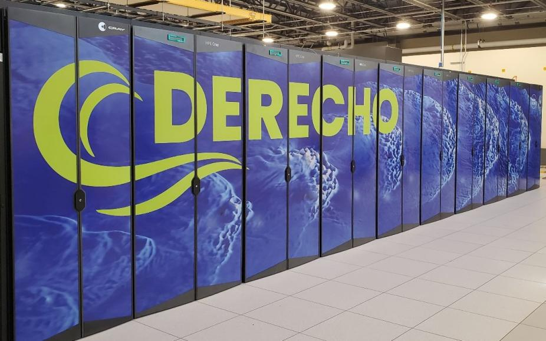

# Multi-Node PyTorch Distributed Training on NCAR's Derecho
[](https://negin513.github.io/distributed-pytorch-hpc/)
[](https://github.com/NCAR/distributed-pytorch-hpc)


This repository contains example workflows for executing multi-node, multi-GPU machine learning training using PyTorch on NCAR's HPC Supercomputers (i.e. Derecho), along with example PBS scripts for running them.

While this code is written to run directly on [Derecho](https://ncar-hpc-docs.readthedocs.io/en/latest/compute-systems/derecho/) GPU nodes, it can be adapted for other GPU HPC machines.

The docs in this repository are meant to be a quick start guide for users who want to learn more about distributed training paradigms. 

<!--
<p align="center">
  
</p>
-->

## Quick Start on Derecho

If you want to skip the background and jump straight to running distributed PyTorch on Derecho, follow these steps:

```bash
git clone https://github.com/negin513/distributed-pytorch-hpc
cd distributed-pytorch-hpc
module reset
module load conda mkl cuda
conda env create -f environment.yml
conda activate pytorch-derecho
```

```bash
# Verify your setup
python -c "import torch; print(f'PyTorch {torch.__version__}, GPUs: {torch.cuda.device_count()}, NCCL: {torch.cuda.nccl.version()}')"
```

```bash
# Run your first distributed job
cd scripts/01_data_parallel_ddp
qsub torchrun_multigpu_ddp.sh -A <your_account>
```
